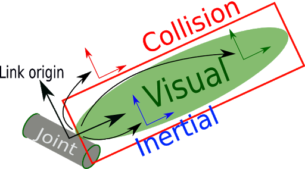

# Create a sensor (SDF file)

**The sensor SDF  file contains:**

* The inertial data, the collision and visual geometric descriptions.
  
  * **Interia:** describes the dynamic properties of the link, like mass and rotational inertia matrix, it will be zero if not specified

    **The interia elements**

    `<mass>` Descripte the mass value of the link.

    `<interia>` The rotational inertia matrix which is represented in the inertia frame, using the attributes ixx, iyy, izz.

  
  * **Collision:** encapsulates a geometry which is used for collision checking. you can choice any shape to descripe the collision as you prefer. note that the collision properties different than the visual properities.

    **The collision elements**

    `<geometry>` The shape of the collision element

    There are other elements relative to the geometry element and they are based on the shape of the sensor.
    
  * **Visual:** used to visualize parts of a link (the shape of the sensor), the link maybe contains more than one visual element or zero visual element.
  
    **The visual tag elements**

    `<geometry>` The shape of the visual element.

    There are other elements relative to the geometry element and they are based on the shape of the sensor.
    
  The figure below clarifies the interia, collision and visual elements:

  

  [reference]((https://wiki.ros.org/urdf/XML/link))

* Sensor and plugin  descriptions.
  
  The sensor tag describe the type and the specifications of the sensor.

    **The senosr tag elemnts**

    `<always_on>` When it is true the sensor will always be updated due to update rate.

    `<update_rate>` Frequency of the generated data from the sensor.When it is upspecified the sensor will generate data every cycle.

    `<visualize>` When it is true the sensor will be visualized in the GUI.

    `<topic>` The name of the topic where the sensor publishes the data.

    `<plugin>` Load dynamically a specific library to the code, each sensor has its own plugin and each plugin has a unique name.The sensor may has no plugin element in it.

    There are other elements based on the type of the sensor.

